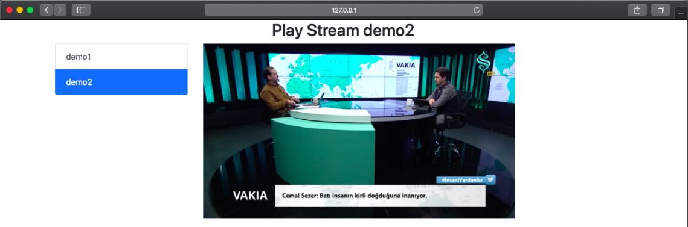

# DVRIPtoWebRTC


###WORK in progress!! not full work


DVRIP Stream to WebBrowser over WebRTC based on Pion

full native! not use ffmpeg or gstreamer




### Download Source

1. Download source
   ```bash 
   $ git clone https://github.com/deepch/DVRIPtoWebRTC  
   ```
3. CD to Directory
   ```bash
    $ cd DVRIPtoWebRTC/
   ```
4. Test Run
   ```bash
    $ GO111MODULE=on go run *.go
   ```
5. Open Browser
    ```bash
    open web browser http://127.0.0.1:8083 work chrome, safari, firefox
    ```

## Configuration

### Edit file config.json

format:

```bash
{
  "server": {
    "http_port": ":8083",
    "ice_servers": ["stun:stun.l.google.com:19302"],
    "ice_username": "",
    "ice_credential": ""
  },
  "streams": {
    "H264_AAC": {
      "on_demand": false,
      "disable_audio": true,
      "url": "dvrip://95.72.95.9/Main"
    }
  }
}

```

## Livestreams

Use option ``` "on_demand": false ``` otherwise you will get choppy jerky streams and performance issues when multiple clients connect. 

## Limitations

Video Codecs Supported: H264

Audio Codecs Supported: pcm alaw and pcm mulaw 

## Team

Deepch - https://github.com/deepch streaming developer

Dmitry - https://github.com/vdalex25 web developer

Now test work on (chrome, safari, firefox) no MAC OS

## Other Example

Examples of working with video on golang

- [RTSPtoWeb](https://github.com/deepch/RTSPtoWeb)
- [DVRIPtoWebRTC](https://github.com/deepch/DVRIPtoWebRTC)
- [RTSPtoWSMP4f](https://github.com/deepch/RTSPtoWSMP4f)
- [RTSPtoImage](https://github.com/deepch/RTSPtoImage)
- [RTSPtoHLS](https://github.com/deepch/RTSPtoHLS)
- [RTSPtoHLSLL](https://github.com/deepch/RTSPtoHLSLL)

[](https://www.paypal.me/AndreySemochkin) - You can make one-time donations via PayPal. I'll probably buy a ~~coffee~~ tea. :tea: